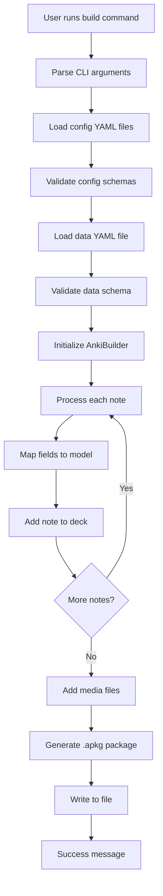
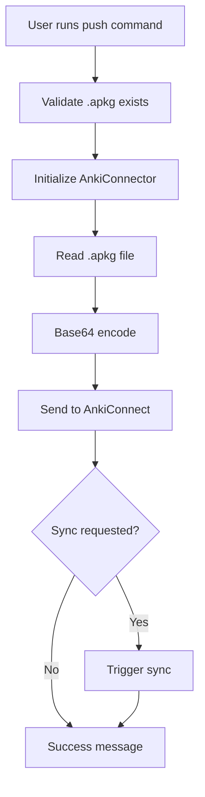
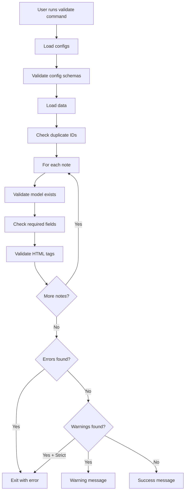

# Architecture Documentation

This document describes the architecture and design patterns of the Anki Python Deck Tool.

## Table of Contents

- [Overview](#overview)
- [Core Components](#core-components)
- [Data Flow](#data-flow)
- [Module Organization](#module-organization)
- [Design Patterns](#design-patterns)
- [Extension Points](#extension-points)

## Overview

The Anki Python Deck Tool is a CLI application for generating Anki decks from YAML files. It follows a modular architecture with clear separation of concerns:

```
User Input (YAML) → Parser → Builder → Package Generator → Output (.apkg)
                      ↓
                   Validator
                      ↓
                  Media Handler
```

### Key Design Principles

1. **Separation of Concerns**: Each module has a single, well-defined responsibility
2. **Type Safety**: Modern Python type hints throughout
3. **Error Handling**: Custom exceptions with clear error messages
4. **Testability**: Dependency injection and mocking-friendly design
5. **Extensibility**: Support for plugins and custom processors (planned)

## Core Components

### 1. CLI Layer (`cli.py`)

**Responsibility**: Command-line interface and user interaction

**Key Functions**:
- `build()` - Build .apkg files from YAML
- `push()` - Upload to Anki via AnkiConnect
- `validate()` - Validate YAML without building

**Design Notes**:
- Uses Click framework for command parsing
- Handles user-facing error messages
- Coordinates between core modules
- No business logic; pure orchestration

```python
# Example flow in build command
def build(data, config, output, deck_name):
    configs = load_model_config(config)  # Load
    items = load_deck_data(data)          # Parse
    builder = AnkiBuilder(deck_name, configs)  # Initialize

    for item in items:
        builder.add_note(...)  # Build

    builder.write_to_file(output)  # Output
```

### 2. Configuration Loader (`core/config.py`)

**Responsibility**: Load and parse YAML configuration files

**Key Functions**:
- `load_model_config()` - Load and validate model configurations
- `load_deck_data()` - Load and validate note data

**Design Notes**:
- Uses `yaml.safe_load()` for security
- Integrates with pydantic validators
- Returns type-safe dictionaries
- Raises `ConfigValidationError` or `DataValidationError`

```python
def load_model_config(config_path: str | Path) -> ModelConfigComplete:
    """Load and validate model configuration from YAML."""
    # 1. Load YAML
    # 2. Validate schema with pydantic
    # 3. Return typed dictionary
```

### 3. Validator Module (`core/validators.py`)

**Responsibility**: Schema validation and data integrity checks

**Key Components**:
- `ModelConfigSchema` - Pydantic model for note type configs
- `NoteData` - Pydantic model for note data
- `validate_note_fields()` - Field presence validation
- `validate_html_tags()` - HTML syntax checking
- `check_duplicate_ids()` - ID uniqueness validation

**Design Notes**:
- Uses Pydantic for declarative validation
- Provides detailed error messages
- Separates validation from business logic
- Supports strict and lenient modes

```python
class ModelConfigSchema(BaseModel):
    """Schema for note type configuration."""
    name: str
    fields: list[str]
    templates: list[ModelTemplate]
    css: str = ""

    @field_validator("fields")
    @classmethod
    def validate_fields(cls, v: list[str]) -> list[str]:
        # Custom validation logic
```

### 4. Builder (`core/builder.py`)

**Responsibility**: Construct Anki decks and notes

**Key Class**: `AnkiBuilder`

**Key Methods**:
- `__init__()` - Initialize with deck name and model configs
- `add_note()` - Add individual notes to deck
- `add_media()` - Add media files to package
- `write_to_file()` - Generate .apkg file

**Design Notes**:
- Wraps genanki library
- Manages multiple note types per deck
- Uses stable hashing for IDs (SHA256-based)
- Maintains media file list

```python
class AnkiBuilder:
    def __init__(self, deck_name: str, model_configs: list[ModelConfigComplete]):
        self.deck_name = deck_name
        self.models = self._build_models()
        self.deck = genanki.Deck(self.stable_id(deck_name), deck_name)
        self.media_files: list[str] = []

    def stable_id(self, name: str) -> int:
        """Generate deterministic ID from name."""
        # SHA256 hash converted to integer
        # Ensures consistent IDs across rebuilds
```

### 5. Connector (`core/connector.py`)

**Responsibility**: Communication with AnkiConnect API

**Key Class**: `AnkiConnector`

**Key Methods**:
- `invoke()` - Generic AnkiConnect API caller
- `import_package()` - Upload .apkg to Anki
- `sync()` - Trigger AnkiWeb sync
- `store_media_file()` - Upload media files

**Design Notes**:
- Uses requests library for HTTP
- Converts exceptions to `AnkiConnectError`
- Provides retry logic (future enhancement)
- Base64 encodes file data

```python
class AnkiConnector:
    def invoke(self, action: str, params: dict | None = None) -> dict:
        """Send request to AnkiConnect."""
        response = requests.post(self.url, json={
            "action": action,
            "params": params or {},
            "version": self.version
        })
        # Handle errors and return result
```

### 6. Media Handler (`core/media.py`)

**Responsibility**: Media file management

**Key Functions**:
- `validate_media_file()` - Check file exists and is readable
- `discover_media_files()` - Find media in directory
- `get_media_references()` - Extract references from HTML
- `validate_media_references()` - Check all references exist

**Design Notes**:
- Supports images, audio, video
- Regex-based reference extraction
- Provides missing file reports
- Case-insensitive file matching

```python
def get_media_references(html_text: str) -> set[str]:
    """Extract media references from HTML."""
    # Find: , [sound:...], etc.
    # Return: set of filenames
```

### 7. Exception Hierarchy (`core/exceptions.py`)

**Responsibility**: Structured error handling

```python
AnkiToolError (base)
├── ConfigValidationError
├── DataValidationError
├── MediaMissingError
├── DeckBuildError
└── AnkiConnectError
```

**Design Notes**:
- All inherit from base `AnkiToolError`
- Include context (file paths, error details)
- Clear, actionable error messages
- Enable specific exception catching

## Data Flow

### Build Command Flow



### Push Command Flow



### Validate Command Flow



## Module Organization

```
anki_yaml_tool/
├── cli.py                  # Command-line interface
└── core/
    ├── __init__.py
    ├── builder.py          # Deck construction
    ├── config.py           # YAML loading
    ├── connector.py        # AnkiConnect integration
    ├── exceptions.py       # Custom exceptions
    ├── media.py            # Media file handling
    └── validators.py       # Schema validation
```

### Module Dependencies

```
cli.py
├── core.builder
├── core.config
├── core.connector
├── core.exceptions
├── core.media
└── core.validators

core.builder
├── core.exceptions
└── genanki (external)

core.config
├── core.validators
└── core.exceptions

core.connector
├── core.exceptions
└── requests (external)

core.media
└── core.exceptions

core.validators
└── pydantic (external)
```

**Design Note**: No circular dependencies; clear hierarchy

## Design Patterns

### 1. Builder Pattern

**Used in**: `AnkiBuilder` class

**Purpose**: Construct complex Anki packages step by step

```python
builder = AnkiBuilder("My Deck", configs)
builder.add_note(fields, tags, model_name)
builder.add_note(fields, tags, model_name)
builder.add_media("image.png")
builder.write_to_file("output.apkg")
```

### 2. Facade Pattern

**Used in**: `AnkiConnector` class

**Purpose**: Simplify AnkiConnect API interaction

```python
connector = AnkiConnector()
connector.import_package(path)  # Hides complex request logic
connector.sync()
```

### 3. Strategy Pattern (Planned)

**Used in**: Plugin system (future)

**Purpose**: Allow custom field processors and validators

```python
# Future API
builder.add_processor("markdown", MarkdownProcessor())
builder.add_processor("latex", LaTeXProcessor())
```

### 4. Factory Pattern

**Used in**: Model creation in `AnkiBuilder`

**Purpose**: Create genanki models from configurations

```python
def _build_models(self) -> dict[str, genanki.Model]:
    """Factory method to create models from configs."""
    models = {}
    for config in self.model_configs:
        model = genanki.Model(
            model_id=self.stable_id(config["name"]),
            name=config["name"],
            fields=[{"name": field} for field in config["fields"]],
            templates=...
        )
        models[config["name"]] = model
    return models
```

## Extension Points

### Current Extension Points

1. **Custom Exceptions**: Extend `AnkiToolError` for specific error types
2. **Validators**: Add new pydantic validators in `validators.py`
3. **Media Handlers**: Extend `media.py` for new media types

### Planned Extension Points (Future)

1. **Field Processors**: Plugin system for custom field transformations
2. **Data Sources**: Import from CSV, JSON, databases, APIs
3. **Template Engines**: Support Jinja2, Mustache templating
4. **Export Formats**: Generate formats beyond .apkg

## Key Design Decisions

### 1. Stable IDs

**Decision**: Use SHA256 hash of name for deck/model IDs

**Rationale**:
- Ensures consistent IDs across rebuilds
- Preserves user progress when reimporting
- Avoids random ID generation issues

```python
def stable_id(self, name: str) -> int:
    """Generate deterministic ID from name using SHA256."""
    hash_object = hashlib.sha256(name.encode("utf-8"))
    hash_int = int(hash_object.hexdigest(), 16)
    return hash_int % (10**10)  # Limit to 10 digits
```

### 2. Multiple Model Support

**Decision**: Allow multiple note types in single deck

**Rationale**:
- Real-world decks often mix card types
- Keeps related content together
- Simplifies workflow

**Implementation**: Accept multiple `--config` arguments, store `model` field in data

### 3. Validation Separation

**Decision**: Separate `validate` command from `build`

**Rationale**:
- Fast feedback during authoring
- CI/CD integration without building
- Strict mode for production validation

### 4. Type Safety with Pydantic

**Decision**: Use Pydantic for validation

**Rationale**:
- Declarative schema definition
- Auto-generated validation
- Type-safe data structures
- Better error messages than manual validation

## Testing Strategy

### Test Organization

```
tests/
├── test_builder.py       # AnkiBuilder tests
├── test_cli.py           # CLI command tests
├── test_config.py        # Config loading tests
├── test_connector.py     # AnkiConnect tests
├── test_exceptions.py    # Exception tests
├── test_media.py         # Media handling tests
└── test_validators.py    # Validation tests
```

### Testing Approaches

1. **Unit Tests**: Test individual functions and methods
2. **Integration Tests**: (Planned) Test full build pipeline
3. **Mocking**: Mock external dependencies (requests, file I/O)
4. **Fixtures**: Use pytest fixtures for common test data

### Coverage Goals

- **Target**: >90% code coverage
- **Current**: ~89% (CLI has lower coverage due to error paths)
- **Priority**: Core logic must have 100% coverage

## Performance Considerations

### Current Performance

- **Small decks** (<100 cards): <1 second
- **Medium decks** (100-1000 cards): 1-3 seconds
- **Large decks** (1000+ cards): 3-10 seconds

### Optimization Opportunities

1. **Parallel processing**: Process notes concurrently (future)
2. **Incremental builds**: Only rebuild changed notes (future)
3. **Memory management**: Stream large files instead of loading fully (future)

## Security Considerations

### Current Security Measures

1. **YAML Safety**: Use `yaml.safe_load()` to prevent code injection
2. **Path Validation**: Check file paths exist and are readable
3. **Input Sanitization**: Validate all user inputs
4. **Dependency Scanning**: Weekly `pip-audit` and `bandit` scans

### AnkiConnect Security

- Runs on localhost only (127.0.0.1:8765)
- No authentication (assumes trusted local environment)
- Never exposed to internet

## Future Architecture Enhancements

### Phase 3 Features

1. **Plugin System**: Allow custom processors and validators
2. **Watch Mode**: File watching with auto-rebuild
3. **Bidirectional Sync**: Pull decks from Anki back to YAML
4. **GUI**: Desktop application for visual deck management

### Scalability Considerations

- **Database Integration**: Support pulling from databases
- **Batch Processing**: Handle multiple decks in one operation
- **Cloud Integration**: Support cloud storage and collaboration
- **API Mode**: Run as web service for team usage

---

## References

- [genanki Documentation](https://github.com/kerrickstaley/genanki)
- [AnkiConnect API](https://foosoft.net/projects/anki-connect/)
- [Anki Manual](https://docs.ankiweb.net/)
- [Pydantic Documentation](https://docs.pydantic.dev/)
